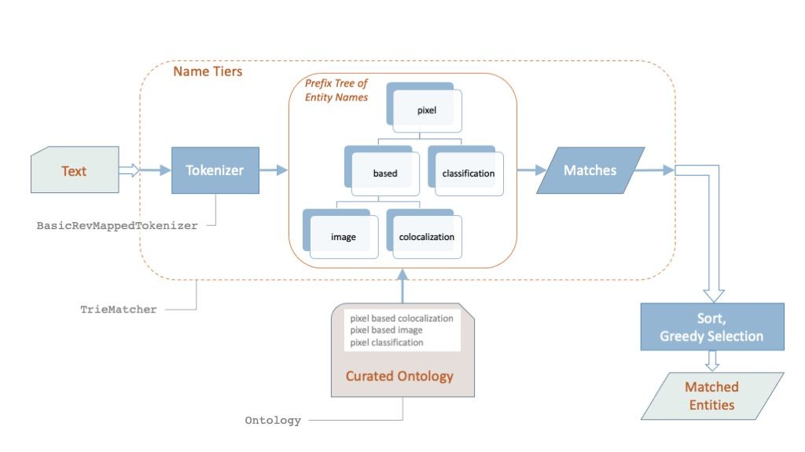

# Ontomatcher Documentation

_Ontomatcher_ is a general purpose, configurable, fast mention detector of ontology terms (or entities) in plain text. It is implemented in Python. The detection of mentions relies on text normalization and 'dictionary lookup' of known names and synonyms. The speed comes from its use of the [prefix tree (aka trie)](https://en.wikipedia.org/wiki/Trie) data structure.

We will use terms and entities interchangeably in this document.

## Requirements

For code requirements, go [here](../ReadMe.md#requirements).

## Entity Matcher Example

For an example of how to use Ontomatcher, to find mentions of bio-imaging terms from the EDAM ontology, [read this](ReadMe_NapariPlugin.md).

## Main Components of Ontomatcher

### class TrieMatcher: EntityMatcher

To create a term mention detector, you need to create an instance of [TrieMatcher](ontomatch/text/triematcher.py#L250), add to it each term or entity you want to be able to detect, along with its synonyms, and then use it to detect mentions of the added terms in plain text.

[`TrieMatcher.EXAMPLE_PARAMS`](ontomatch/text/triematcher.py#L252) describes an example of the configurable options that can be specified to instantiate a `TrieMatcher` instance.

[EntityMatcher](ontomatch/text/nttmatcher.py#L52) is an abstract class that specifies the API for building a mention detector, and for using it to detect entity mentions.

The class [TrieMatcher](ontomatch/text/triematcher.py#L250) encapsulates an implementation of this API. 

A term or entity consists of a unique Term-ID (aka Entity-ID), a Primary Name, and a number of alternative names, possibly of multiple types (e.g. exact synonyms, Acronyms, approximate synonyms). These name-types are assigned tiers, which are ordered (tiers are integers, with their natural ascending sort order). With each type of name is also associated a token normalization style (e.g. convert to lower case, stem).

A mention of a term must exactly match one of the term's names, using the normalization style defined for that name-type.

The TrieMatcher works by tokenizing and normalizing all names and text. It then uses a [prefix tree](https://en.wikipedia.org/wiki/Trie) (also called a _trie_) for fast detection of all names in a piece of text. These name matches are then sorted so that matches of 'higher' tiers are preferred, and longer matches within a tier are preferred.

If your use-case does not allow overlapping mentions, then you can use the `get_greedy_nonoverlapping_matches(text)` method which does a greedy search for non-overlapping mentions, preferring matches in 'higher' tiers. For a full description of the sort order, take a look at the [TrieMatcher.get\_greedy\_nonoverlapping\_matches](ontomatch/text/triematcher.py#L547) implementation.

The more general purpose method `get_all_matching_entities(text)` will return all possible name matches into `text`.

### class BasicRevMappedTokenizer

The [BasicRevMappedTokenizer](ontomatch/text/tokenizer.py#L68) class implements a tokenizer, with configurable character standardization (e.g. transliterating accented characters into non-accented characters) and various token normalization types (e.g. lower-casing, stemming, lemmatization) supported. 

When a text is tokenized using the `BasicRevMappedTokenizer.tokenize(text)` method, it returns a list of `Token` objects, which encapsulate the tokenized string, and its position in the source `text`.

### class Ontology

[Ontology](ontomatch/data/ontology.py#L135) is a convenience class for holding an ontology, consisting of a directed acyclic graph (DAG) of [OntologyTerm](ontomatch/data/ontology.py#L27) objects. You can use it to hold an ontology of named entities or terms that you want to recognize, and on finding matches, use methods in this class to retrieve an entity's information, e.g. its ancestry or description.

### package ontomatch.nprhub

The `ontomatch.nprhub` package contains an application of Ontomatcher for recognizing mentions of bio-imaging terms, as used for recommending categories for Napari Hub plugins. Read [this document](ReadMe_NapariPlugin.md) for a description of that application.